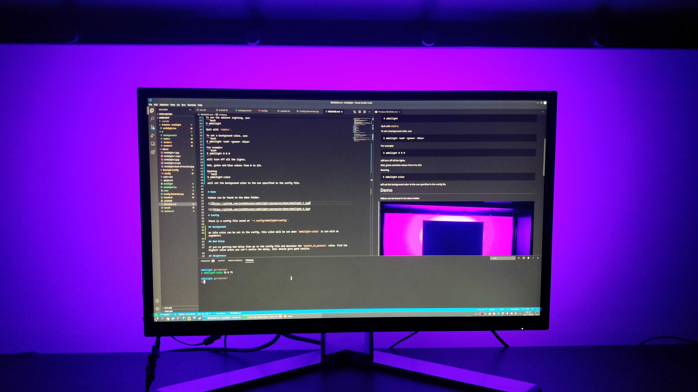

# Ambillight


An ambient lighting solution for the X11 window environment in Linux using an Arduino to control the LEDs.

Multi monitor not currently supported.

## Hardware
* An Arduino - I use a nano
* WS2812b LEDs on a flexible sticky strip - I use 60: 15 for the 2 sides and 30 on top.
* A powersupply for the LEDs - I use a 5V 4A one
* A USB cable is required to run to the Arduino from your computer too

## Software
Dependencies:
* CMake
* A Linux distribution for the naming of the devices
* Arduino IDE - with the `FastLED` library
* [Libconfig](https://github.com/hyperrealm/libconfig) (`libconfig-dev` on Debian based distros - like Raspbian - or `libconfig` on other distros)
* An X11 window enviroment and libraries (the `libx11-dev` package will need to be installed on Debian based distros - like Raspbian - or `libx11` on other distros)

1. Run `install.sh`
2. Upload the `Arduino/ambilight/ambilight.ino` program onto the Arduino - updating the `NUM_LEDS` and `DATA_PIN` to the your values

# Usage

To run the ambient lighting, run:
```bash
$ ambilight
```
Quit with `ctrl+c`.

To set a background color, use:
```bash
$ ambilight <red> <green> <blue>
```
For example:
```bash
$ ambilight 0 0 0
```
will turn off all the lights.

Red, green and blue values from 0 to 254.

Running
```bash
$ ambilight-color
```
will set the background color to the one specified in the config file.




# Config

There is a config file saved at `~/.config/Ambilight/config`.

## Background

An idle color can be set in the config, this color will be set when `ambilight-color` is run with no arguments.

## Bad Delay

If you're getting bad delay then go to the config file and decrease the `pixels_to_process` value. Find the highest value where you can't notice the delay, this should give good results.  

## Brightness

Brightness as an integer out of 100